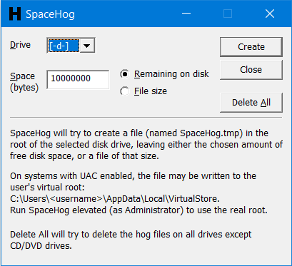

# SpaceHog
SpaceHog does what it says on the tin; it's a program that can fill  disk space with a file of a specified size. This is useful for testing applications that need to handle low disk space situations, such as when a user is trying to save a file and there isn't enough space left on the drive.

You can either configure how much free space remains on a drive, or create a file of a specific size.